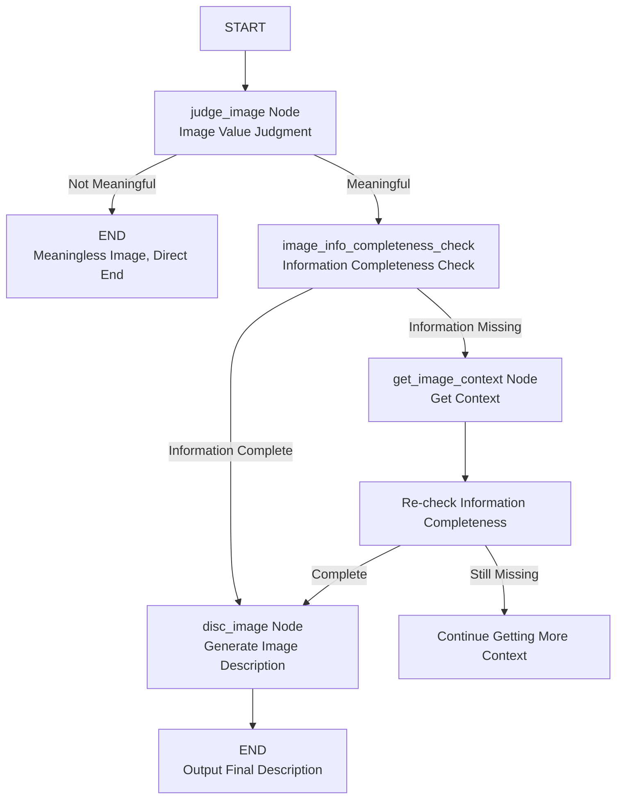

# Your PDF Document Image Description Assistant

This is an intelligent multimodal image understanding system built on the LangGraph framework. By combining advanced vision-language models and state-machine workflows, it automatically analyzes image content, extracts contextual information, and generates high-quality textual descriptions. The system employs a modular design with four core processing stages: image value judgment, information completeness checking, context acquisition, and description generation. Through intelligent routing decisions and iterative optimization mechanisms, it ensures deep understanding and accurate description of various image types.

# Multimodal Image Understanding and Description Generation System

## 📊 System Flowchart



## 🎯 Project Overview

This is a LangGraph-based multimodal AI workflow system specifically designed to analyze images and generate detailed textual descriptions. The system combines image understanding and text analysis capabilities, intelligently judges image value, extracts contextual information, and produces high-quality image descriptions.

## ✨ Core Features

- **Multimodal Processing**: Simultaneously handles image and text information
- **Intelligent Routing**: Automatically determines processing flow based on image content
- **Context-Awareness**: Extracts supplementary information from related documents
- **Cyclical Optimization**: Ensures information completeness through multiple checks
- **Modular Design**: Node-based architecture for easy extension and maintenance

## 🏗️ System Architecture

### 1. State Management
```python
# Input State
class AgentInputState(TypedDict):
    """InputState is only 'messages'."""
    image_path:str    # Image path
    image_name:str    # Image name
    mark_down_path:str # Source markdown path of the image
    image_context:str    # Image context
    Number_of_check: int  # Number of image information completeness checks
    final_image_disc:str  # Final image description
    p_error:str  # Error collection

# Complete Workflow State
class AgentState(TypedDict):
    """InputState is only 'messages'."""
    image_path:str    # Image path
    image_name:str    # Image name
    mark_down_path:str # Source markdown path of the image
    image_context:str    # Image context
    Number_of_check: int  # Number of image information completeness checks
    final_image_disc:str  # Final image description
    p_error:str  # Error collection

### 2. Processing Nodes

| Node | Function | Routing Decision |
|------|----------|------------------|
| `judge_image` | Preliminary image value judgment | Not meaningful → END, Meaningful → Next node |
| `image_info_completeness_check` | Check information completeness | Complete → disc_image, Missing → get_image_context |
| `get_image_context` | Extract document context | Always returns to re-check |
| `disc_image` | Generate final description | Always ends the process |

### 3. Model Configuration
- **Vision Model**: GLM-4.6V (Zhipu AI) - Handles image analysis
- **Text Model**: DeepSeek-Chat - Handles text generation
- **Temperature Setting**: 0.3 - Balances creativity and stability

## 🔧 Technology Stack

- **LangGraph**: State graph workflow engine
- **LangChain**: AI application development framework
- **Zhipu AI GLM-4.6V**: Multimodal vision-language model
- **DeepSeek**: Text generation model
- **Python 3.8+**: Primary programming language

## 📁 Project Structure

```
.
├── disc_pdf_image.py          # Main workflow definition
├── state.py                   # State type definitions
├── prompt.py                  # All prompt templates
├── config.py                  # API key configuration
└── README.md                  # This documentation
```

## 🚀 Quick Start

### Install Dependencies
```bash
pip install langgraph langchain langchain-openai langchain-community
```

### Configure API Keys
Edit the `config.py` file:
```python
chat_model_api_key = "your-deepseek-api-key"
v_model_api_key = "your-zhipuai-api-key"
```

### Run Example
```python
input_state = {
            "image_path": "demo7\hybrid_auto\images\\0fe37b6a0bde3ad5ea0f89422e80523bf8d269cd6ec90701ac0dda61fffa7bc9.jpg", 
            "image_name": "0fe37b6a0bde3ad5ea0f89422e80523bf8d269cd6ec90701ac0dda61fffa7bc9.jpg",
            "mark_down_path": 'demo7\hybrid_auto\demo7.md',  # Markdown file containing image context
            "image_context":" ",
            "Number_of_check": 5,
            "final_image_disc":" ",
            "p_error":" "
        }
r = deep_image_disc.invoke(input_state)
```

## 🧩 Workflow Details

### Stage 1: Image Value Judgment (`judge_image`)
- Convert image to base64 format
- Use GLM-4.6V model to judge if the image has analytical value
- Routing decision: Meaningless images directly end the process

### Stage 2: Information Completeness Check (`image_info_completeness_check`)
- Analyze whether the image needs additional contextual information
- Decision: Complete → generate description, Missing → acquire context

### Stage 3: Context Acquisition (`get_image_context`)
- Find image references from the specified Markdown file
- Extract text content before and after the image as context
- Re-analyze the image combined with the context

### Stage 4: Description Generation (`disc_image`)
- Integrate the image and all collected contextual information
- Generate detailed and accurate image descriptions
- Output final results

## 🔄 Cycle Mechanism

The system includes intelligent cycles to optimize result quality:
```
Information Check → Context Acquisition → Re-check → [Cycle until information is complete]
```

Each cycle:
1. Expands the context search range
2. Integrates new contextual information
3. Re-evaluates information completeness

## ⚙️ Configuration Parameters

### Model Parameters
```python
# DeepSeek Configuration
model = "deepseek-chat"
temperature = 0.3

# GLM-4.6V Configuration
model = "glm-4.6v"
thinking = {"type": "enabled"}  # Enable thinking process
```

### Workflow Parameters
- `Number_of_check`: Maximum check count limit
- `context_range`: Context extraction range (increases with check count)

## 📊 Output Format

The system generates structured output containing:

```json
{
    "image_path": "demo7\hybrid_auto\images\\0fe37b6a0bde3ad5ea0f89422e80523bf8d269cd6ec90701ac0dda61fffa7bc9.jpg", 
    "image_name": "0fe37b6a0bde3ad5ea0f89422e80523bf8d269cd6ec90701ac0dda61fffa7bc9.jpg",
    "mark_down_path": 'demo7\hybrid_auto\demo7.md',  # Markdown file containing image context
    "image_context":"Image context information",
    "Number_of_check": 5,
    "final_image_disc":"Final image description",
    "p_error":" "
}

```

## 🎨 Prompt Design

The system uses carefully designed prompt templates:

1. **IMAGE_JUDGE_PROMPT**: Image value judgment
2. **IMAGE_INFO_EXTRACT_PROMPT**: Information extraction
3. **IMAGE_DISC_PROMPT**: Description generation
4. **IMAGE_INFO_COMPLETENESS_CHECK_PROMPT**: Completeness check

## 🛠️ Extensibility

### Adding New Nodes
```python
def new_node(state: AgentState) -> Command:
    # Custom processing logic
    return Command(goto="next_node", update={"new_field": "value"})

deep_image_disc_builder.add_node("new_node", new_node)
```

### Modifying Routing Logic
```python
# Adjust routing conditions within node functions
if condition:
    return Command(goto="node_a")
else:
    return Command(goto="node_b")
```

## Results
Before Description 

Description Effect Without Added Context:
The image is a **donut (ring) chart** with a black background, illustrating the distribution of responses across two categories (plus a third unlabeled segment). Here’s a breakdown:  
- **Segments & Percentages**:  
  - A purple segment labeled “Agree” (lighter purple) accounts for **48%**.  
  - A darker purple segment labeled “Strongly agree” accounts for **28%**.  
  - A light gray (or white) segment (not labeled in the legend) represents the remaining **24%** (calculated as \\( 100 - 48 - 28 = 24 \\)).  
- **Legend & Design**:  
  - The legend on the right identifies the lighter purple as “Agree” and the darker purple as “Strongly agree.”  
  - Text (percentages and labels) is white, contrasting with the black background for clarity.  

The chart visually compares the proportion of respondents who “Agree” versus “Strongly agree,” with the light gray segment representing the remaining response category (e.g., “Neutral,” “Disagree,” etc.).  
A donut chart with 48% Agree, 28% Strongly agree, and 24% other.

Description Effect With Added Context:
The image displays a donut chart illustrating executives' agreement levels on the statement that conversational interactions using generative AI will become a way to gather relevant customer context. The chart shows two colored segments: a lighter purple segment representing 48% of respondents who "Agree" and a darker purple segment representing 28% who "Strongly agree," with a white/gray segment representing the remaining percentage of respondents. The legend on the right side of the chart clearly identifies the color coding for each response category. This data visualization is part of the Accenture Technology Vision 2025 Executive Survey, which collected responses from 4,021 executives, providing a substantial sample size for the findings presented. The chart effectively communicates that a significant majority (76%) of executives believe conversational AI will be valuable for gathering customer context, highlighting strong industry confidence in this emerging technology application.

## 📈 Performance Optimization

1. **Caching Mechanism**: Can add result caching to avoid repeated processing
2. **Concurrent Processing**: Supports asynchronous execution for improved efficiency
3. **Error Recovery**: Comprehensive exception handling and state recovery
4. **Resource Management**: Reasonably controls API call frequency

## 🐛 Troubleshooting

| Issue | Solution |
|-------|----------|
| KeyError: 'image_path' | Check if the state definition includes all required fields |
| API Call Failure | Verify API keys and network connection |
| File Read Error | Confirm file path and permission settings |
| Infinite Loop Execution | Check `Number_of_check` increment logic |

## 🤝 Contribution Guidelines

1. Fork the project repository
2. Create a feature branch (`git checkout -b feature/AmazingFeature`)
3. Commit your changes (`git commit -m 'Add some AmazingFeature'`)
4. Push to the branch (`git push origin feature/AmazingFeature`)
5. Open a Pull Request

## 📄 License

This project is licensed under the MIT License - see the [LICENSE](LICENSE) file for details.

## 🙏 Acknowledgments

- [LangChain](https://github.com/langchain-ai/langchain) - AI application development framework
- [LangGraph](https://github.com/langchain-ai/langgraph) - State graph workflow engine
- [Zhipu AI](https://open.bigmodel.cn/) - Provides GLM-4.6V model
- [DeepSeek](https://www.deepseek.com/) - Provides text generation model

---

**✨ Let machines better understand the world, starting with understanding images ✨**
