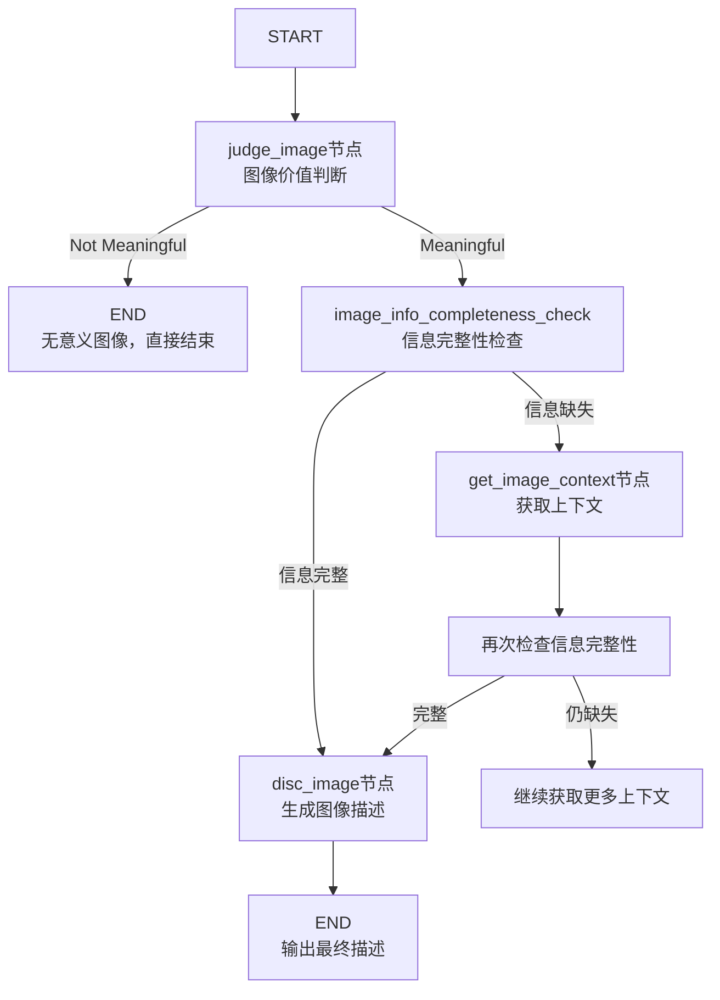

# Your-PDF-document-image-description-assistant
这是一个基于LangGraph框架构建的智能多模态图像理解系统，通过结合先进的视觉语言模型和状态机工作流，能够自动分析图像内容、提取上下文信息，并生成高质量的文字描述。系统采用模块化设计，包含图像价值判断、信息完整性检查、上下文获取和描述生成四个核心处理阶段，通过智能路由决策和迭代优化机制，确保对各类图像的理解深度和描述准确性。

# 多模态图像理解与描述生成系统

## 📊 系统流程图



## 🎯 项目概述

这是一个基于LangGraph的多模态AI工作流系统，专门用于分析图像并生成详细的文字描述。系统结合了图像理解和文本分析能力，能够智能判断图像价值、提取上下文信息，并生成高质量的图像描述。

## ✨ 核心特性

- **多模态处理**: 同时处理图像和文本信息
- **智能路由**: 基于图像内容自动决定处理流程
- **上下文感知**: 从相关文档中提取补充信息
- **循环优化**: 通过多次检查确保信息完整性
- **模块化设计**: 易于扩展和维护的节点式架构

## 🏗️ 系统架构

### 1. 状态管理
```python
# 输入状态
class AgentInputState(TypedDict):
    """InputState is only 'messages'."""
    image_path:str    #图片路径
    image_name:str    #图片名称
    mark_down_path:str #图片源markdown路径
    image_context:str    #图片的上下文
    Number_of_check: int  #图片信息完整性检查次数
    final_image_disc:str  #最终图片描述
    p_error:str  #出错收集

# 完整工作流状态
class AgentState(TypedDict):
    """InputState is only 'messages'."""
    image_path:str    #图片路径
    image_name:str    #图片名称
    mark_down_path:str #图片源markdown路径
    image_context:str    #图片的上下文
    Number_of_check: int  #图片信息完整性检查次数
    final_image_disc:str  #最终图片描述
    p_error:str  #出错收集

### 2. 处理节点

| 节点 | 功能 | 路由决策 |
|------|------|----------|
| `judge_image` | 初步判断图像价值 | 无意义 → END, 有意义 → 下一节点 |
| `image_info_completeness_check` | 检查信息完整性 | 完整 → disc_image, 缺失 → get_image_context |
| `get_image_context` | 提取文档上下文 | 总是返回重新检查 |
| `disc_image` | 生成最终描述 | 总是结束流程 |

### 3. 模型配置
- **视觉模型**: GLM-4.6V（智谱AI）- 处理图像分析
- **文本模型**: DeepSeek-Chat - 处理文本生成
- **温度设置**: 0.3 - 平衡创造性和稳定性

## 🔧 技术栈

- **LangGraph**: 状态图工作流引擎
- **LangChain**: AI应用开发框架
- **智谱AI GLM-4.6V**: 多模态视觉语言模型
- **DeepSeek**: 文本生成模型
- **Python 3.8+**: 主要编程语言

## 📁 项目结构

```
.
├── disc_pdf_image.py          # 主工作流定义
├── state.py                   # 状态类型定义
├── prompt.py                  # 所有提示词模板
├── config.py                  # API密钥配置
└── README.md                  # 本说明文档
```

## 🚀 快速开始

### 安装依赖
```bash
pip install langgraph langchain langchain-openai langchain-community
```

### 配置API密钥
编辑 `config.py` 文件：
```python
chat_model_api_key = "your-deepseek-api-key"
v_model_api_key = "your-zhipuai-api-key"
```

### 运行示例
```python
input_state = {
            "image_path": "demo7\hybrid_auto\images\\0fe37b6a0bde3ad5ea0f89422e80523bf8d269cd6ec90701ac0dda61fffa7bc9.jpg", 
            "image_name": "0fe37b6a0bde3ad5ea0f89422e80523bf8d269cd6ec90701ac0dda61fffa7bc9.jpg",
            "mark_down_path": 'demo7\hybrid_auto\demo7.md',  # 包含图像上下文的Markdown文件
            "image_context":" ",
            "Number_of_check": 5,
            "final_image_disc":" ",
            "p_error":" "
        }
r = deep_image_disc.invoke(input_state)
```

## 🧩 工作流详解

### 阶段1: 图像价值判断 (`judge_image`)
- 将图像转换为base64格式
- 使用GLM-4.6V模型判断图像是否有分析价值
- 路由决策：无意义图像直接结束流程

### 阶段2: 信息完整性检查 (`image_info_completeness_check`)
- 分析图像是否需要额外上下文信息
- 决策：完整则生成描述，缺失则获取上下文

### 阶段3: 上下文获取 (`get_image_context`)
- 从指定Markdown文件中查找图像引用
- 提取图像前后的文本内容作为上下文
- 结合上下文重新分析图像

### 阶段4: 描述生成 (`disc_image`)
- 整合图像和所有收集的上下文信息
- 生成详细、准确的图像描述
- 输出最终结果

## 🔄 循环机制

系统包含智能循环以优化结果质量：
```
信息检查 → 上下文获取 → 重新检查 → [循环直至信息完整]
```

每次循环：
1. 扩大上下文搜索范围
2. 整合新的上下文信息
3. 重新评估信息完整性

## ⚙️ 配置参数

### 模型参数
```python
# DeepSeek配置
model = "deepseek-chat"
temperature = 0.3

# GLM-4.6V配置
model = "glm-4.6v"
thinking = {"type": "enabled"}  # 启用思考过程
```

### 工作流参数
- `Number_of_check`: 最大检查次数限制
- `context_range`: 上下文提取范围（随检查次数增加）

## 📊 输出格式

系统生成的结构化输出包含：

```json
{
    "image_path": "demo7\hybrid_auto\images\\0fe37b6a0bde3ad5ea0f89422e80523bf8d269cd6ec90701ac0dda61fffa7bc9.jpg", 
    "image_name": "0fe37b6a0bde3ad5ea0f89422e80523bf8d269cd6ec90701ac0dda61fffa7bc9.jpg",
    "mark_down_path": 'demo7\hybrid_auto\demo7.md',  # 包含图像上下文的Markdown文件
    "image_context":"图像上下文信息",
    "Number_of_check": 5,
    "final_image_disc":"图像最终描述",
    "p_error":" "
}

```

## 🎨 提示词设计

系统使用精心设计的提示词模板：

1. **IMAGE_JUDGE_PROMPT**: 图像价值判断
2. **IMAGE_INFO_EXTRACT_PROMPT**: 信息提取
3. **IMAGE_DISC_PROMPT**: 描述生成
4. **IMAGE_INFO_COMPLETENESS_CHECK_PROMPT**: 完整性检查

## 🛠️ 扩展性

### 添加新节点
```python
def new_node(state: AgentState) -> Command:
    # 自定义处理逻辑
    return Command(goto="next_node", update={"new_field": "value"})

deep_image_disc_builder.add_node("new_node", new_node)
```

### 修改路由逻辑
```python
# 在节点函数中调整路由条件
if condition:
    return Command(goto="node_a")
else:
    return Command(goto="node_b")
```

##效果
描述前

未添加上下文描述效果：
\nThe image is a **donut (ring) chart** with a black background, illustrating the distribution of responses across two categories (plus a third unlabeled segment). Here’s a breakdown:  \n\n- **Segments & Percentages**:  \n  - A purple segment labeled “Agree” (lighter purple) accounts for **48%**.  \n  - A darker purple segment labeled “Strongly agree” accounts for **28%**.  \n  - A light gray (or white) segment (not labeled in the legend) represents the remaining **24%** (calculated as \\( 100 - 48 - 28 = 24 \\)).  \n\n- **Legend & Design**:  \n  - The legend on the right identifies the lighter purple as “Agree” and the darker purple as “Strongly agree.”  \n  - Text (percentages and labels) is white, contrasting with the black background for clarity.  \n\n\nThe chart visually compares the proportion of respondents who “Agree” versus “Strongly agree,” with the light gray segment representing the remaining response category (e.g., “Neutral,” “Disagree,” etc.).  \nA donut chart with 48% Agree, 28% Strongly agree, and 24% other.

添加上下文描述效果：
The image displays a donut chart illustrating executives' agreement levels on the statement that conversational interactions using generative AI will become a way to gather relevant customer context. The chart shows two colored segments: a lighter purple segment representing 48% of respondents who "Agree" and a darker purple segment representing 28% who "Strongly agree," with a white/gray segment representing the remaining percentage of respondents. The legend on the right side of the chart clearly identifies the color coding for each response category. This data visualization is part of the Accenture Technology Vision 2025 Executive Survey, which collected responses from 4,021 executives, providing a substantial sample size for the findings presented. The chart effectively communicates that a significant majority (76%) of executives believe conversational AI will be valuable for gathering customer context, highlighting strong industry confidence in this emerging technology application.


## 📈 性能优化

1. **缓存机制**: 可添加结果缓存避免重复处理
2. **并发处理**: 支持异步执行提高效率
3. **错误恢复**: 完善的异常处理和状态恢复
4. **资源管理**: 合理控制API调用频率

## 🐛 故障排除

| 问题 | 解决方案 |
|------|----------|
| KeyError: 'image_path' | 检查状态定义是否包含所有必需字段 |
| API调用失败 | 验证API密钥和网络连接 |
| 文件读取错误 | 确认文件路径和权限设置 |
| 循环无限执行 | 检查`Number_of_check`递增逻辑 |

## 🤝 贡献指南

1. Fork项目仓库
2. 创建功能分支 (`git checkout -b feature/AmazingFeature`)
3. 提交更改 (`git commit -m 'Add some AmazingFeature'`)
4. 推送到分支 (`git push origin feature/AmazingFeature`)
5. 开启Pull Request

## 📄 许可证

本项目采用MIT许可证 - 查看 [LICENSE](LICENSE) 文件了解详情。

## 🙏 致谢

- [LangChain](https://github.com/langchain-ai/langchain) - AI应用开发框架
- [LangGraph](https://github.com/langchain-ai/langgraph) - 状态图工作流引擎
- [智谱AI](https://open.bigmodel.cn/) - 提供GLM-4.6V模型
- [DeepSeek](https://www.deepseek.com/) - 提供文本生成模型


---

**✨ 让机器更好地理解世界，从理解图像开始 ✨**
